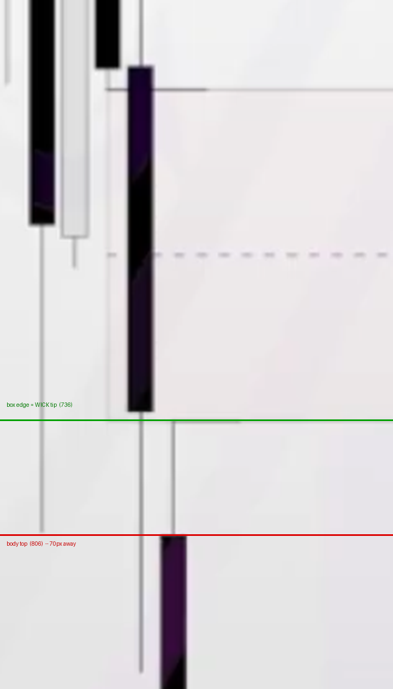

# حدود الفراغ السعري — قياسٌ من الشاشة يغلق C9

**المصدر:** لقطتان من درس الفجوات السعرية (المستخدم، 2026-08-31)
**السؤال:** الفراغ يُرسم **ذيلًا لذيل** أم **ذيلًا لجسم**؟

> ⭐⭐⭐ **حُسم بالقياس لا بالترجيح.** ولم يتغيّر الكود — كان صحيحًا.

---

## 1. لماذا لم يكفِ النصّ

في التفريغ النصّي يقول ثلاث جمل تبدو متناقضة:

| الوقت | القول |
|---|---|
| 2:23 | «شرطها إنه… **الويك تبع الشمعة هذا نحن ما بنحسبه** من ضمن الفير فاليو جاب» |
| 2:32 | «**مثل ما شايفين هون** إنه أنا راسم الفير فاليو جاب **من الذيل إلى الجسم**» |
| 2:39 | «**إذا كان حتى في عنّا ذيال هون** رح تصير الفير فاليو جاب بهالطريقة» |

الأولى تنفي الذيل، والثانية تُثبته طرفًا، والثالثة تجعل الشكل تابعًا لوجود
الذيول. و«**شايفين هون**» إشارةٌ إلى الشاشة — فالمعنى في الصورة لا في الصوت.

---

## 2. ⭐⭐⭐ القياس — لقطتان مستقلّتان

الصندوق المرسوم على الشارت (XAUUSD · 15m) وخطّ منتصفه المتقطّع عند 50% تمامًا،
وهو ما يؤكّد أنه **الفراغ السعري** لا كائنًا آخر.

**الحافة السفلى للصندوق = قمة الشمعة الثالثة** — وهذا موضع الحسم، لأن
تلك الشمعة **لها ذيل علويّ طويل**، فالذيل والجسم متباعدان جدًّا:

| | اللقطة الأولى | اللقطة الثانية |
|---|---|---|
| حافة الصندوق السفلى | **y = 736** | **y = 787** |
| **طرف الذيل** العلوي للشمعة الثالثة | **y = 736** ✅ | **y = 787** ✅ |
| **أعلى الجسم** للشمعة الثالثة | y = 806 ❌ | y = 858 ❌ |
| الفارق بين الذيل والجسم | **70 بكسل** | **71 بكسل** |

قياس السطوع عبر العمود يفصل الذيل عن الجسم بلا لبس:

```
اللقطة الأولى · العمود x=1045
   y=733  سطوع 231   ← فراغ فوق الذيل
   y=736  سطوع 179   ← بداية الذيل  = حافة الصندوق
   y=800  سطوع 175   ← الذيل مستمرّ
   y=806  سطوع  81   ← بداية الجسم
   y=880  سطوع  35   ← الجسم
```

⇒ **الحافة تقف على طرف الذيل، والجسم يبعد عنها 70 بكسل.**
هذا فارق لا يُفسَّر بخطأ يد في الرسم.



---

## 3. ⭐⭐ وبهذا تستقيم جمله الثلاث

الحدّ الأعلى للصندوق يقع عند **قاع الشمعة الأولى** — وتلك الشمعة في المثال
**بلا ذيل سفليّ**، فقاعها هو **أسفل جسمها** نفسه (تحقّقنا: السطوع تحت الجسم
يقفز من 19 إلى 207، أي لا ذيل).

فالصندوق يمتدّ فعلًا **من ذيلٍ إلى جسم** — لا لأن القاعدة تخلط المرجعين، بل
لأن:

> **الفراغ محدود بطرفَي الشمعتين الأولى والثالثة — أيًّا كان الطرف.**
> فإن كان هناك ذيل فالذيل، وإن لم يكن فحافة الجسم هي الطرف.

وعليه:

| الجملة | معناها الصحيح |
|---|---|
| «الويك تبع الشمعة ما بنحسبه» | ذيول **الشمعة الوسطى** (الاندفاع) لا تدخل الحساب |
| «راسم من الذيل إلى الجسم» | **وصفُ هذا المثال**: طرفٌ صادف ذيلًا وطرفٌ صادف جسمًا |
| «إذا كان في عنّا ذيال… بهالطريقة» | ووجود الذيول يغيّر الشكل — لأن الأطراف هي الحدّ |

---

## 4. الأثر على الكود — لا شيء

`primitives/fvg.py` ينفّذ هذا حرفيًّا منذ الدرس 5:

```python
صاعد : low[i] > high[i-2]   ⇒ المنطقة (high[i-2] .. low[i])
هابط : high[i] < low[i-2]   ⇒ المنطقة (high[i] .. low[i-2])
```

و`high` و`low` في `Candle` هما الذيلان — ويساويان حافّتي الجسم تلقائيًّا
حين لا ذيل. **فالتنفيذ يطابق المقيس، ولم تُغيَّر سطر واحد.**

⭐ **وهذا يحمي بوابة الـ50%**: منتصف الفراغ هو مرجع الدخول، وحافّة واحدة
مغلوطة كانت ستزيحه — ومعه كل نقطة دخول في البوت.

---

## 5. حدّ هذا الدليل

المثال يثبت **طرفًا واحدًا** إثباتًا قاطعًا (الشمعة الثالثة، ذات الذيل
الطويل). أما الطرف الآخر فشمعته بلا ذيل، **فلا يميّز** بين القاعدتين — وهو
متّسق معهما معًا. ولا يضرّ: القاعدة «الأطراف» تشرح الطرفين، والقاعدة
«الأجسام» يكذّبها الطرف المقيس.

**درجة الثقة: عالية** — لقطتان مستقلّتان، فارق 70 بكسل، ونصٌّ يستقيم به.
